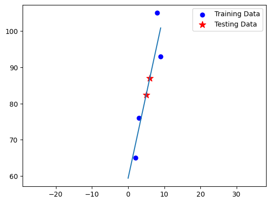

# Linear Regression

https://en.wikipedia.org/wiki/Linear_regression

The Linear Regression model uses data points given to it and finds a line that is as close as it can be to all the points. Since the data might be very spread out, it may not touch every point. It uses this line when given new data to find out about. It uses the new data by finding it on the line by putting it as a x-value and then finding what is on the y-axis for the answer.

